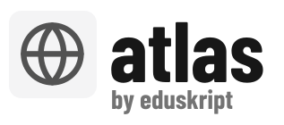

<p align="center">
  <a href="https://atlas.eduskript.org"><picture>
    <source media="(prefers-color-scheme: dark)" srcset="public/logo-dark.svg">
    
  </picture></a>
</p>

Gemeinsame Sammlung von Unterrichtsmaterialien für Schweizer Gymnasien, geordnet nach dem [Rahmenlehrplan Maturitätsschulen (EDK 2024)](https://edudoc.ch/record/232281/files/Rahmenlehrplan-maturitatsschulen.pdf) — live auf [atlas.eduskript.org](https://atlas.eduskript.org). Aktuell: Grundlagenfach Informatik.

Lehrpersonen melden einen Link. Atlas crawlt die Quelle, ordnet jedes Material den Kompetenzen des Lehrplans zu (Gemini Flash Lite mit erzwungenem Enum-Output), schreibt eine Kurzzusammenfassung und verlinkt aufs Original — gespeichert werden Links, keine Kopien. Ranking und Tag-Kuration macht die Community per Up-/Downvote.

## Connectors

| Quelle | Mechanik | Änderungserkennung |
|---|---|---|
| Websites | Sitemap, sonst Links der Startseite | ETag / Text-Hash pro Seite |
| Git-Repos (GitHub, GitLab, Codeberg) | shallow clone; Markdown pro Datei, LaTeX-Skripts als ein Material | HEAD-SHA, Datei-Hashes |
| OneDrive/SharePoint, Nextcloud | anonymes Listing (Shares-API bzw. WebDAV), selektiver Download | Datei-Hash / ETag aus dem Listing |
| Dropbox | Ordner-Zip (kein anonymes Listing) | Text-Hash pro Datei |

Extrahiert werden PDF, docx, pptx, odt, Markdown, HTML und LaTeX; Videos nur über den Dateinamen. Der nächtliche Crawl fasst nur an, was sich geändert hat — unveränderte Inhalte kosten keinen AI-Call. Tote Quellen werden nach drei Fehlnächten ausgeblendet, verschobene Inhalte behalten via Content-Hash ihre Votes.

## Stack

Node/TypeScript-Monolith: Express + server-gerendertes HTML + HTMX, Prisma auf SQLite (FTS5 für die Volltextsuche), Python nur als Extraktionswerkzeug (trafilatura, pdftotext). Auth über Microsoft OAuth + Magic-Link. Details und Entscheide: [CLAUDE.md](CLAUDE.md).

## Lokal starten

```sh
npm install
python3 -m venv .venv && .venv/bin/pip install trafilatura
npx prisma migrate deploy && npx prisma generate
npm run seed        # Lehrplan (27 Kompetenzen GF Informatik) + Tags
npm run dev         # http://localhost:3000
```

Ohne `OPENROUTER_API_KEY` in `.env` klassifiziert ein Offline-Mock; `npm run crawl` stösst den Crawl von Hand an (`-- --force` reklassifiziert alles).

## Deployment

Docker Compose (App + Caddy mit Auto-TLS), SQLite als Bind-Mount, nächtlicher Crawl per systemd-Timer. Deploy = `git push` auf ein Bare-Repo mit post-receive-Hook; läuft auf einem 1-vCPU-VPS.

## Status

Prototyp in aktiver Entwicklung. Es fehlen u.a. Admin-UI (Lehrplan-Erfassung, Tag-Kuration), Tag-Vorschlags-Voting, Rate-Limits und Mail bei toten Links.

## Lizenz

[AGPL-3.0](LICENSE) — wie [Eduskript](https://github.com/marcchehab/eduskript).
